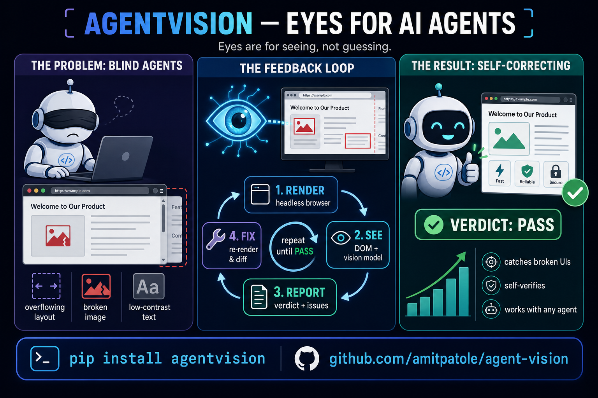
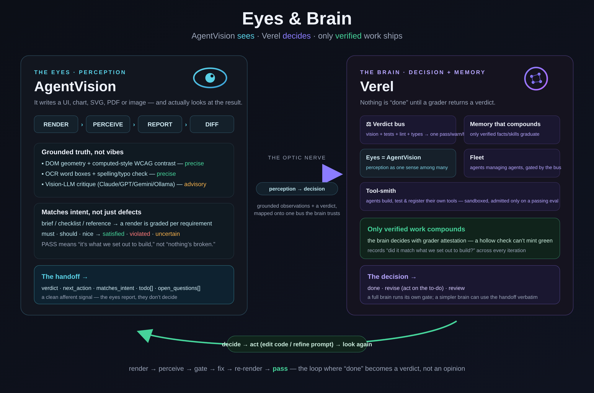

# AgentVision — Eyes for AI Agents 👁️

<p align="center">
  
</p>

> **Problem:** AI coding agents are *blind* — they write a UI, chart, SVG, PDF or image and
> never *see* the result, shipping breakage they can't perceive.
> **Result:** AgentVision gives them eyes — **render → see → report → fix** — so the agent
> **self-corrects before it claims done.**

```bash
pip install "agentvision[render]"
playwright install chromium      # see `agentvision doctor` if Chromium won't launch
agentvision demo                 # no API key required
```

`agentvision demo` renders a deliberately broken page, prints a **FAIL** report (overflow +
low-contrast + a 404 image — all DOM/CV-grounded, no LLM key), then loops against the fixed
version and prints *"what changed: 3 issues resolved → PASS."*

## What it does

| Capability | What you get |
|---|---|
| **See & report** | A machine verdict (`pass`/`warn`/`fail`) + coordinate-grounded issues — DOM geometry, computed-style WCAG contrast, clipped/truncated text (incl. SVG chart labels & PPTX text boxes), OCR/typos, broken-image & console/4xx capture. |
| **[Match intent](conformance.md)** | Grade a render against a brief / checklist / reference — PASS means *"it's what I set out to build,"* not just *"defect-free."* |
| **[Full-coverage vision](backends.md)** | Large artifacts get a downscaled overview **plus full-res tiles** — pixel-based & source-agnostic (HTML, image, PDF, canvas). |
| **[Streaming / temporal](use-cases/streaming.md)** | `watch` verifies behavior over time — playback, loading, liveness — not just a single glance. |
| **[Eyes → brain handoff](handoff.md)** | A distilled `{verdict, next_action, todo, open_questions}` signal any agent/brain acts on. |

## Where to go next

<div class="grid cards" markdown>

- :material-rocket-launch: **[Quickstart](quickstart.md)** — install, system deps, first run.
- :material-hand-wave: **[Try it yourself](try-it.md)** — a key-free, copy-paste FAIL→PASS in minutes.
- :material-school: **[5-minute tutorial](tutorial.md)** — check → analyze → conform → loop.
- :material-lightbulb-on: **[Use cases](use-cases.md)** · :material-play-box: **[Real-world scenarios](examples.md)** — runnable demos, real output.
- :material-sync: **[The loop](the-loop.md)** — render → perceive → report → fix → diff.
- :material-target: **[Conformance](conformance.md)** — grade against intent.
- :material-server-network: **[Swarms & scaling](scaling.md)** — eyes as a service for a fleet of agents.
- :material-brain: **[Handoff](handoff.md)** — wire perception into your reasoning/memory.
- :material-cog: **[Workflows & agents](integrations.md)** — GitHub Action, pre-commit, MCP, the agent contract.
- :material-console: **[CLI reference](cli.md)** · :material-tune: **[Configuration](configuration.md)** · :material-language-python: **[Python API](api.md)**
- :material-book-open-variant: **[Recipes](recipes.md)** · :material-help-circle: **[FAQ](faq.md)**

</div>

## Many agents, one set of eyes

One agent with eyes self-corrects. A **swarm** of agents sharing one set of eyes is the real
prize — dozens of workers each rendering UIs, charts, decks or PDFs, every output graded against
the same contract before it counts as done. Run the eyes as a horizontally-scaled
**[service](scaling.md)** (or embed the library per worker); single-shot grading scales with zero
coordination, and because every worker returns the same
[`agentsensory`](https://pypi.org/project/agentsensory/) `Report`, a coordinator or a brain like
[Verel](handoff.md) aggregates all the verdicts on **one bus**. See **[Swarms &
scaling](scaling.md)**.

## Eyes & brain

AgentVision is the **eyes**. It pairs with **[Verel](https://github.com/amitpatole/verel)**, the
**brain** — an agent framework where *nothing is "done" until a grader returns a verdict.* The
eyes perceive and grade intent; the brain decides and **compounds only verified work** into
memory; then the eyes look again.

<p align="center">
  
</p>

Install: `pip install "agentvision[all]"` · Source: [GitHub](https://github.com/amitpatole/agent-vision)
· Package: [PyPI](https://pypi.org/project/agentvision/) · License: MIT.
