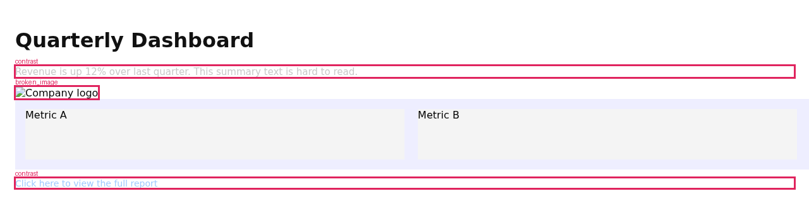
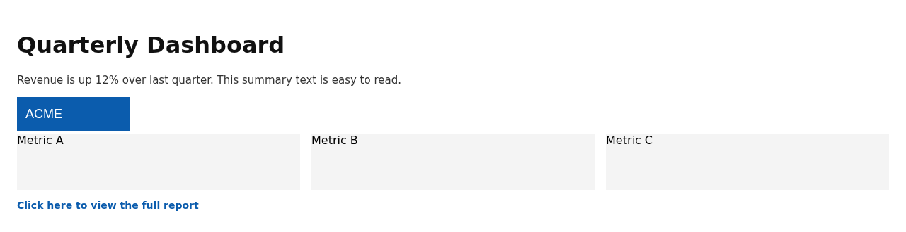

# Quickstart

## Install

```bash
pip install "agentvision[render]"        # rendering + offline local loop (no key)
# or everything (all backends + adapters):
pip install "agentvision[all]"
```

Install the Chromium browser used for rendering:

```bash
playwright install chromium
```

### System dependencies

Chromium needs OS libraries that `playwright install` does **not** install.

- **Debian/Ubuntu:** `playwright install --with-deps chromium`
- **RHEL/CentOS/Fedora** (no `--with-deps` support):

  ```bash
  sudo dnf install -y nss nspr atk at-spi2-atk at-spi2-core cups-libs libdrm \
    mesa-libgbm libxkbcommon libXcomposite libXdamage libXrandr libXfixes \
    libXrender pango cairo alsa-lib gtk3
  ```

- **Optional extras:** `tesseract-ocr tesseract-ocr-eng` (OCR), `poppler-utils` (PDF).

Verify everything:

```bash
agentvision doctor          # attempts a real Chromium launch; lists any missing libs
agentvision doctor --fix    # installs the Chromium browser binary
```

Or skip all of this with the bundled **Dockerfile** (deps baked in):

```bash
docker build -t agentvision .
docker run --rm -v "$PWD:/work" agentvision demo
```

## First run (no API key)

```bash
agentvision demo
```

The eyes render a deliberately broken page and **mark exactly what's wrong** — low-contrast
text, a broken image, content overflow — all DOM/CV-grounded, no API key:



That produces a **FAIL** report (this is the actual output):

```text
  FAIL  (local)
  Heuristic structural analysis (no semantic critique): found 4 issue(s).

  • [contrast] Low contrast (ratio 1.66, needs 4.5 for AA) on text 'Revenue is up 12%…' @(24,105) (dom/high)
  • [contrast] Low contrast (ratio 1.70, needs 4.5 for AA) on text 'Click here to view the full report' @(24,283) (dom/high)
  • [overflow] Page content overflows horizontally by 976px (causes a horizontal scrollbar). (dom/high)
  • [broken_image] Broken image (failed to load): missing-logo.png @(24,138) (dom/high)
```

The agent fixes the source and looks again — now **PASS**, with a "what changed" diff:



```text
  PASS  (local)
  Structural checks passed (no DOM/CV defects detected).

   what changed: Moderate visual change (SSIM 0.972); 12 region(s) differ.

✓ The agent SAW the problems and fixed them — FAIL → PASS.
```

That FAIL → PASS arc, in ~60 seconds with no key, *is* the product.

## Everyday use

```bash
agentvision check  ./index.html --json          # structural checks, no key
agentvision analyze ./index.html --backend anthropic   # + semantic critique (needs key)
agentvision loop   ./index.html --max-iter 3
agentvision sheet  ./index.html
agentvision baseline ./index.html --name home && agentvision regress ./index.html --name home
```

Set a key to enable semantic analysis:

```bash
export ANTHROPIC_API_KEY=sk-ant-...   # or OPENAI_API_KEY / GOOGLE_API_KEY
```

## Running securely (production)

AgentVision renders **untrusted** HTML/URLs, so it's hardened by default (SSRF blocked
incl. DNS-rebinding via a vetting egress proxy, Chromium sandbox on, image-bomb caps). For a
networked deployment, add these belt-and-suspenders:

- **Restrict the renderer's egress** to a network that denies outbound to `169.254.0.0/16`
  (metadata), RFC-1918, and CGNAT — a defense-in-depth backstop around the app controls.
- **Containerize** so the Chromium OS sandbox is available without `--no-sandbox`.
- **REST service**: it stays loopback-only with zero config; to expose it, set
  `AGENTVISION_API_TOKEN` (binding a routable host without one is refused) and front it with TLS.
- Keep `block_private_networks` on (default); only use `--allow-local` against trusted targets.

Full threat model and the complete control list:
[SECURITY.md](https://github.com/amitpatole/agent-vision/blob/main/SECURITY.md).
